# 🏆 EvalX: AI-Powered Hackathon Evaluation Platform

**Turning subjective judging into objective data in under 60 seconds.**

EvalX is a production-ready, scalable AI platform that evaluates **Presentations**, **Code Quality**, and **Technical Understanding** simultaneously - providing ranked leaderboards, domain-specific insights, and actionable mentor feedback at scale.

🔗 **Live Frontend**: [https://eval-x.vercel.app/](https://eval-x.vercel.app/)


---

## 📋 Table of Contents

- [The Problem](#-the-problem)
- [The Solution](#-the-solution-evalx)
- [System Architecture](#-system-architecture)
- [Scalability & Infrastructure](#-scalability--infrastructure)
- [Failure Handling & Resilience](#-failure-handling--resilience)
- [Core Evaluation Modules](#-core-evaluation-modules)
- [Domain-Specific Evaluators](#-domain-specific-evaluators)
- [Analytics Engine](#-analytics-engine)
- [Tech Stack](#-tech-stack)
- [Getting Started](#-getting-started)
- [Team & Contributions](#-team--contributions)

---

## 🚨 The Problem

**Hackathons are broken. Judges are exhausted, bias creeps in, and flashy UIs win over solid code.**

| Pain Point | Impact |
|------------|--------|
| **50+ submissions, 10 judges, 12-hour window** | Impossible to maintain quality |
| **Code quality ignored** | Judges focus on demos, not implementation |
| **Inconsistent scoring** | Different judges = different standards |
| **Zero actionable feedback** | Participants get scores but no guidance |
| **No verification of understanding** | Copy-pasted code goes undetected |

**The Reality**: *12 hours of judging compressed into 3 minutes per team = rushed decisions and missed talent.*

---

## 💡 The Solution: EvalX

**A production-grade, multi-modal AI evaluation platform that processes concurrent submissions at scale with real-time progress tracking, domain-specific analysis, and comprehensive mentorship feedback.**

```mermaid
graph LR
    subgraph "Input"
        A[📊 PPT Upload]
        B[💻 GitHub URL]
        C[🎤 Voice Interview]
    end
    
    subgraph "EvalX Engine"
        D[🤖 AI Processing]
    end
    
    subgraph "Output"
        E[📈 Scores & Rankings]
        F[📝 Mentor Reports]
        G[📊 Analytics]
    end
    
    A --> D
    B --> D
    C --> D
    D --> E
    D --> F
    D --> G
```



### What Makes EvalX Different

| Feature | Traditional Judging | EvalX |
|---------|---------------------|-------|
| **Evaluation Time** | 15-30 min/team | < 60 seconds |
| **Code Analysis** | Surface-level review | 9-phase deep audit |
| **Consistency** | Varies by judge | AI-calibrated scoring |
| **Feedback** | Generic comments | Actionable mentor reports |
| **Scale** | 50 teams max | Horizontally scalable |
| **Domain Expertise** | Limited availability | 5 specialized evaluators |

### User Journey


---

## 🏗️ System Architecture

### High-Level Architecture


### Component Interaction Flow


### Data Flow Diagram (DFD)

#### Level 0: Context Diagram

```mermaid
flowchart TB
    ORG["👨‍💼 ORGANIZER"]
    DEV["👨‍💻 DEVELOPER/TEAM"]
    AI_EXT["🤖 AI SERVICES"]
    
    EVALX(["⚡ EvalX Platform"])
    
    ORG -->|"Event Config, Criteria"| EVALX
    EVALX -->|"Analytics, Leaderboards"| ORG
    
    DEV -->|"PPT, GitHub, Voice"| EVALX
    EVALX -->|"Scores, Feedback"| DEV
    
    EVALX <-->|"Vision, NLP, Analysis"| AI_EXT
```



**Data Flows Summary:**

| From | To | Data |
|------|-----|------|
| Organizer | EvalX | Event configuration, Judging criteria, Team invites |
| EvalX | Organizer | Analytics dashboard, Leaderboards, Export reports |
| Developer | EvalX | PPT upload, GitHub URL, Voice answers, PDF docs |
| EvalX | Developer | Evaluation scores, AI feedback, Mentor reports |
| EvalX | AI Services | Code for analysis, Slides for vision, Audio for STT |
| AI Services | EvalX | Analysis results, Vision insights, Transcriptions |

#### Level 1: Detailed Data Flow


**Process Details:**

| Process | Function | Input | Output |
|---------|----------|-------|--------|
| **1.0 Submit** | Validate & queue submissions | PPT, GitHub URL, Voice, PDF | Task queued in Redis |
| **2.0 PPT Eval** | Vision-based slide analysis | PPT slides | Presentation score |
| **3.0 GitHub Audit** | 9-phase code analysis | Repository URL | Code quality metrics |
| **4.0 Interview** | Voice Q&A evaluation | Audio recordings | Interview scores |
| **5.0 Domain** | Specialized pattern matching | Code repository | Domain-specific score |
| **6.0 Analytics** | Aggregation & anomaly detection | All scores | Reports & exports |

#### Data Dictionary

| Data Flow | Description | Format |
|-----------|-------------|--------|
| **PPT File** | Uploaded presentation | `.pptx`, max 50MB |
| **GitHub URL** | Repository link | HTTPS URL |
| **Voice Recording** | Interview answer audio | WebM/MP3, max 2min |
| **Project PDF** | Project description document | PDF, max 10MB |
| **Evaluation Scores** | Computed scores per module | JSON: `{ppt, github, viva, domain}` |
| **Mentor Reports** | AI-generated feedback | Markdown document |
| **Leaderboard** | Ranked team scores | JSON array with rankings |
| **Analytics Data** | Aggregated metrics | JSON with statistical measures |

### API Route Architecture

| Category | Endpoints | Description |
|----------|-----------|-------------|
| **Authentication** | `POST /api/auth/signup`<br>`POST /api/auth/login` | User registration & JWT token generation |
| **Dashboard** | `GET /api/dashboard/*` | User-specific dashboard data |
| **Developer** | `GET/POST /api/developer/*` | Developer operations & events |
| **Team** | `GET/POST /api/team/*` | Team management & submissions |
| **PPT Evaluation** | `POST /api/ppt/*` | Presentation upload & analysis |
| **GitHub Audit** | `POST /api/github/*` | Repository evaluation |
| **Interview** | `POST /api/interview/*` | Voice interview sessions |
| **Domain Eval** | `POST /api/domain-evaluation/*` | Specialized domain analysis |
| **Async Submit** | `POST /api/async/submit/*` | Background task submission |
| **WebSocket** | `WS /ws/submission/*` | Real-time progress updates |

```mermaid
flowchart TB
    subgraph AUTH["🔐 Auth"]
        A1["signup"]
        A2["login"]
    end
    
    subgraph CORE["📋 Core"]
        B1["dashboard"]
        B2["developer"]
        B3["team"]
    end
    
    subgraph EVAL["🎯 Evaluation"]
        C1["ppt"]
        C2["github"]
        C3["interview"]
        C4["domain"]
    end
    
    subgraph ASYNC["⚡ Async"]
        D1["async submit"]
        D2["websocket"]
    end
    
    subgraph ANALYTICS["📊 Analytics"]
        E1["org analytics"]
        E2["participant"]
    end
    
    AUTH --> CORE
    CORE --> EVAL
    EVAL --> ASYNC
    ASYNC --> ANALYTICS
```

| **Analytics** | `GET /api/analytics/org/*`<br>`GET /api/analytics/participant/*` | Organizer & participant insights |



---

## ⚡ Scalability & Infrastructure

### Distributed Task Processing

EvalX uses **Celery** with **Redis** as the message broker to handle concurrent submissions without blocking the main API.

```mermaid
graph TB
    subgraph "Task Distribution"
        API[FastAPI API] -->|Enqueue| RQ[(Redis Broker)]
        
        RQ -->|Route| Q1[ppt_queue]
        RQ -->|Route| Q2[github_queue]
        RQ -->|Route| Q3[viva_queue]
        
        Q1 --> W1[PPT Worker ×4]
        Q2 --> W2[GitHub Worker ×2]
        Q3 --> W3[Viva Worker ×2]
    end
    
    subgraph "Worker Configuration"
        W1 -->|Max 600s| T1[PPT Evaluation Task]
        W2 -->|Max 600s| T2[GitHub Audit Task]
        W3 -->|Max 600s| T3[Viva Processing Task]
    end
```



#### Queue Configuration

| Queue | Workers | Concurrency | Purpose |
|-------|---------|-------------|---------|
| `ppt_queue` | 1 | 4 | Slide extraction & GPT vision analysis |
| `github_queue` | 1 | 2 | Repository cloning & multi-phase audit |
| `viva_queue` | 1 | 2 | Audio transcription & answer evaluation |

#### Task Settings
```python
celery_app.conf.update(
    task_serializer="json",
    result_serializer="json", 
    task_time_limit=600,        # 10 minute hard limit
    worker_concurrency=4,       # Parallel task execution
    worker_prefetch_multiplier=1 # Fair task distribution
)
```

### Caching Strategy


#### Cache Hit Strategy
- **Repository Evaluation**: Cached by `repo_url + commit_hash` - same commit = instant results
- **PPT Analysis**: Cached by file hash - re-uploads skip processing
- **Leaderboards**: Short TTL ensures near-real-time updates without DB hammering

### WebSocket Real-Time Updates


#### WebSocket Message Types

| Type | Payload | Description |
|------|---------|-------------|
| `status` | `{stage, message}` | General status updates |
| `progress` | `{percentage, current_stage}` | Progress with percentage |
| `complete` | `{results, score, grade}` | Evaluation finished |
| `error` | `{error_code, message}` | Error occurred |

### Docker Infrastructure


#### Container Health Checks
```yaml
services:
  redis:
    healthcheck:
      test: ["CMD", "redis-cli", "ping"]
      interval: 10s
      timeout: 5s
      retries: 5
      
  mongodb:
    healthcheck:
      test: ["CMD", "mongosh", "--eval", "db.adminCommand('ping')"]
      interval: 10s
      timeout: 10s
      retries: 5
```

---

## 🛡️ Failure Handling & Resilience

### Error Recovery Architecture

```mermaid
graph TD
    subgraph "Task Execution"
        T[Task Starts] --> E{Error?}
        E -->|No| S[Success]
        E -->|Yes| R{Retry Count}
        R -->|< 2| W[Wait 60s]
        W --> T
        R -->|≥ 2| F[Mark Failed]
        F --> N[Notify User]
        F --> L[Log Error]
    end
    
    subgraph "Graceful Degradation"
        C{Cache Available?}
        C -->|Yes| CR[Return Cached Result]
        C -->|No| FP[Fallback Processing]
    end
```



### Retry Logic

| Component | Max Retries | Backoff | Failure Action |
|-----------|-------------|---------|----------------|
| PPT Evaluation | 2 | 60 seconds | Return partial results |
| GitHub Audit | 2 | 120 seconds | Skip failed phase, continue |
| Viva Processing | 2 | 30 seconds | Save progress, allow resume |
| External API | 3 | Exponential | Use cached response |

### Health Monitoring


#### Health Check Response
```json
{
  "status": "healthy",
  "version": "1.0.0",
  "services": {
    "domain_evaluators": "active",
    "analytics": "active",
    "async_queue": "active",
    "websocket": "active"
  }
}
```

### Graceful Degradation Strategies

| Failure Scenario | Degradation Strategy |
|------------------|---------------------|
| Redis unavailable | Fall back to synchronous processing |
| OpenAI API timeout | Return cached similar analysis |
| GitHub clone fails | Retry with different mirror |
| WebSocket disconnect | Auto-reconnect with exponential backoff |
| Worker crash | Task automatically re-queued |

---

## 🔧 Core Evaluation Modules

### Module 1: PPT Evaluator

Analyzes presentation slides using GPT-4o-mini vision to evaluate communication effectiveness.


#### Scoring Formula
```
Clarity Score    = (headline + key_message + text_density + readability) / 4 × 100
Design Score     = (alignment + contrast + visual_hierarchy) / 3 × 100
Story Score      = (problem + solution + use_case + logical_flow) / 4 × 100
Overall Score    = (Clarity + Design + Story + Completeness) / 4
```

---

### Module 2: GitHub Auditor

9-phase deep technical analysis of code repositories.


#### Final Score Calculation
```
Final Score = (100 - plagiarism) × 0.30
            + logic_score × 0.25
            + relevance_score × 0.20
            + style_score × 0.15
            + (pylint × 10) × 0.05
            + structure_score × 0.05
```

#### Grade Assignment
| Score Range | Grade |
|-------------|-------|
| 90-100 | A+ |
| 80-89 | A |
| 70-79 | B |
| 60-69 | C |
| Below 60 | D |

---

### Module 3: AI Interview System

Voice-based technical interview to verify understanding and detect potential plagiarism.


#### Interview Scoring Criteria

Each answer is scored 0-10 based on:
- **Technical Correctness**: Factual accuracy of the answer
- **Clarity**: How clearly concepts are explained
- **Depth**: Level of detail and understanding
- **Relevance**: Connection to the actual project

---

## 🎯 Domain-Specific Evaluators

EvalX includes **5 specialized evaluators** with **76 unique detection patterns** for accurate domain-specific assessment.


### Evaluator Details

#### 🔗 Web3/Blockchain Evaluator
**File Extensions**: `.sol`, `.vy`, `.rs` (Solidity, Vyper, Rust/Anchor)

| Pattern Category | Examples |
|-----------------|----------|
| Security | Reentrancy guards, Access control, Safe math |
| Standards | ERC-20, ERC-721, ERC-1155 implementation |
| DeFi | Liquidity pools, Flash loans, Staking mechanisms |
| Best Practices | Event emission, Oracle integration, Gas optimization |

**Scoring Weights**:
- Security: 35%
- Architecture: 25%
- Best Practices: 20%
- Innovation: 10%
- Completeness: 10%

#### 🧠 ML/AI Evaluator
**File Extensions**: `.py`, `.ipynb`, `.yaml`, `.pkl`

| Pattern Category | Examples |
|-----------------|----------|
| Frameworks | TensorFlow, PyTorch, scikit-learn, Transformers |
| Architectures | CNN, RNN, Transformer, Attention mechanisms |
| MLOps | Experiment tracking, Model versioning, ONNX export |
| Training | Learning rate schedulers, Early stopping, Checkpointing |

**Scoring Weights**:
- Architecture: 30%
- Best Practices: 30%
- Innovation: 20%
- Security: 10%
- Completeness: 10%

#### 💰 Fintech Evaluator
| Pattern Category | Examples |
|-----------------|----------|
| Payments | Payment gateways, Recurring billing, Processing |
| Security | PCI compliance, Encryption at rest, Audit logging |
| Compliance | KYC/AML, Regulatory reporting, Double-entry bookkeeping |
| Integration | Open banking APIs, Plaid integration |

#### 📡 IoT Evaluator
| Pattern Category | Examples |
|-----------------|----------|
| Protocols | MQTT, CoAP, WebSocket |
| Device Management | Provisioning, OTA updates, Authentication |
| Data | Telemetry, Sensor readings, Edge processing |

#### 🥽 AR/VR Evaluator
| Pattern Category | Examples |
|-----------------|----------|
| Engines | Unity, Unreal, WebXR |
| Tracking | Hand tracking, Head tracking, Eye tracking, Image tracking |
| Performance | Frame optimization, LOD system, Object occlusion |

---

## 📊 Analytics Engine

Comprehensive analytics for both organizers and participants.

```mermaid
flowchart TB
    subgraph COLLECT["📥 Data Collection"]
        S["Submissions"]
        E["Events"]
        T["Teams"]
        AG["MongoDB Aggregation"]
        S --> AG
        E --> AG
        T --> AG
    end
    
    subgraph ORG["👨‍💼 Organizer Analytics"]
        OA1["AI Calibration"]
        OA2["Theme Analysis"]
        OA3["Heatmaps"]
        OA4["Anomaly Detection"]
        OA5["Trends"]
    end
    
    subgraph PART["👨‍💻 Participant Analytics"]
        PA1["Skill Radar"]
        PA2["Peer Comparison"]
        PA3["Progress Timeline"]
    end
    
    subgraph EXPORT["📤 Export"]
        CSV["CSV Export"]
        PDF["PDF Report"]
    end
    
    AG --> OA1
    AG --> OA2
    AG --> OA3
    AG --> OA4
    AG --> OA5
    AG --> PA1
    AG --> PA2
    AG --> PA3
    
    OA1 --> CSV
    OA2 --> CSV
    OA3 --> CSV
    OA4 --> CSV
    OA5 --> CSV
    
    PA1 --> PDF
    PA2 --> PDF
    PA3 --> PDF
```



### Organizer Analytics Features

| Feature | Description |
|---------|-------------|
| **AI Calibration** | Mean, median, std deviation, variance, IQR of scores |
| **Theme Analysis** | Performance breakdown by project theme |
| **Submission Patterns** | Heatmap of submission times (day × hour) |
| **Anomaly Detection** | Z-score based identification of unusual scores |
| **Historical Trends** | Cross-event performance comparisons |

### Participant Analytics Features

| Feature | Description |
|---------|-------------|
| **Skill Radar** | 6-dimension visualization (Design, Code Quality, Logic, Documentation, Testing, Innovation) |
| **Peer Comparison** | Percentile ranking within event |
| **Progress Timeline** | Improvement tracking across events |

### Analytics API Endpoints

```
GET /api/analytics/org/{event_id}/calibration    → AI scoring consistency
GET /api/analytics/org/{event_id}/themes         → Theme-wise breakdown
GET /api/analytics/org/{event_id}/patterns       → Submission heatmap
GET /api/analytics/org/{event_id}/trends         → Historical comparison
GET /api/analytics/org/{event_id}/export         → CSV download

GET /api/analytics/participant/{user_id}/radar   → Skill visualization
GET /api/analytics/participant/{user_id}/peers   → Peer comparison
GET /api/analytics/participant/{user_id}/progress → Timeline view
```

---

## 🛠️ Tech Stack

### Frontend
| Technology | Purpose |
|------------|---------|
| **React 19** | UI framework with concurrent features |
| **Vite** | Fast build tool and HMR dev server |
| **TailwindCSS** | Utility-first styling |
| **Framer Motion** | Smooth animations |
| **Canvas API** | Custom chart rendering |
| **WebSocket** | Real-time updates |

### Backend
| Technology | Purpose |
|------------|---------|
| **FastAPI** | Async Python web framework |
| **Celery** | Distributed task queue |
| **Redis** | Message broker + caching |
| **Motor** | Async MongoDB driver |
| **WebSockets** | Real-time communication |
| **Pydantic** | Data validation |

### AI & Analysis
| Technology | Purpose |
|------------|---------|
| **OpenAI GPT-4o-mini** | Code review, PPT analysis, interviews |
| **OpenAI Whisper** | Speech-to-text transcription |
| **OpenAI TTS** | Text-to-speech for interviews |
| **Groq Llama-3.1** | Fast event description generation |
| **Radon** | Code complexity analysis |
| **Pylint** | Code quality scoring |
| **jscpd** | Plagiarism detection |

### Infrastructure
| Technology | Purpose |
|------------|---------|
| **Docker Compose** | Container orchestration |
| **MongoDB Atlas** | Cloud database |
| **Cloudinary** | File storage CDN |
| **Vercel** | Frontend hosting |
| **Azure Container Apps** | Backend deployment |

---

## 🚀 Getting Started

### Prerequisites
- Docker & Docker Compose
- Node.js 18+
- Python 3.10+
- OpenAI API key

### Quick Start with Docker

```bash
# Clone the repository
git clone https://github.com/NischayJoshi/EvalX.git
cd EvalX

# Configure environment variables
cp .env.example .env
# Edit .env with your API keys

# Start all services
docker-compose up -d

# Services will be available at:
# - Frontend: http://localhost:5173
# - Backend API: http://localhost:8000
# - API Docs: http://localhost:8000/docs
# - Celery Flower: http://localhost:5555
```

### Manual Setup

<details>
<summary>📂 Backend Setup</summary>

```bash
cd backend

# Create virtual environment
python -m venv venv
source venv/bin/activate  # On Windows: venv\Scripts\activate

# Install dependencies
pip install -r requirements.txt

# Configure environment
cp .env.example .env
# Add: MONGODB_USERNAME, MONGODB_PASSWORD, OPEN_AI_KEY, REDIS_URL

# Start the server
uvicorn app:app --reload --port 8000

# In separate terminals, start Celery workers:
celery -A celery_app worker -Q ppt_queue -c 4
celery -A celery_app worker -Q github_queue -c 2
celery -A celery_app worker -Q viva_queue -c 2
```
</details>

<details>
<summary>📂 Frontend Setup</summary>

```bash
cd frontend

# Install dependencies
npm install

# Configure environment
echo "VITE_API_URL=http://localhost:8000/api" > .env

# Start development server
npm run dev
```
</details>

### Environment Variables

| Variable | Description |
|----------|-------------|
| `MONGODB_USERNAME` | MongoDB Atlas username |
| `MONGODB_PASSWORD` | MongoDB Atlas password |
| `MONGODB_DB` | Database name (default: evalx) |
| `OPEN_AI_KEY` | OpenAI API key |
| `GROQ_API_KEY` | Groq API key (optional) |
| `REDIS_URL` | Redis connection URL |
| `CLOUDINARY_*` | Cloudinary credentials |

---

## 📁 Project Structure

```
evalx/
├── backend/
│   ├── app.py                      # FastAPI application
│   ├── celery_app.py               # Celery configuration
│   ├── config/
│   │   └── db.py                   # MongoDB connection
│   ├── routes/
│   │   ├── auth.py                 # Authentication
│   │   ├── dashboard.py            # Organizer endpoints
│   │   ├── developer.py            # Developer endpoints
│   │   ├── team.py                 # Team management
│   │   ├── interview.py            # AI Viva system
│   │   ├── analytics.py            # Analytics endpoints
│   │   ├── async_submissions.py    # Async submission handling
│   │   ├── websocket.py            # Real-time updates
│   │   └── domain_evaluation.py    # Domain-specific eval
│   ├── graph/
│   │   ├── ppt_evaluator.py        # PPT analysis
│   │   └── github.py               # GitHub audit
│   ├── evaluators/                 # Domain evaluators
│   │   ├── base.py                 # Abstract base class
│   │   ├── orchestrator.py         # Evaluation coordination
│   │   ├── registry.py             # Evaluator factory
│   │   ├── constants.py            # 76 detection patterns
│   │   └── domain/
│   │       ├── web3_evaluator.py
│   │       ├── ml_evaluator.py
│   │       ├── fintech_evaluator.py
│   │       ├── iot_evaluator.py
│   │       └── arvr_evaluator.py
│   ├── analytics/                  # Analytics engine
│   │   ├── models.py               # Pydantic models
│   │   ├── organizer_analytics.py  # Organizer metrics
│   │   ├── participant_analytics.py # Participant metrics
│   │   ├── aggregation_pipelines.py # MongoDB pipelines
│   │   └── export_service.py       # CSV/JSON export
│   ├── tasks/                      # Celery tasks
│   │   ├── ppt_task.py
│   │   ├── github_task.py
│   │   └── viva_task.py
│   └── utils/
│       └── cache.py                # Redis caching
│
├── frontend/
│   ├── src/
│   │   ├── App.jsx
│   │   ├── Pages/
│   │   │   ├── Organizer/
│   │   │   │   ├── OrganizerDashboard.jsx
│   │   │   │   └── Analytics/
│   │   │   └── Developer/
│   │   │       ├── DeveloperDashboard.jsx
│   │   │       ├── Analytics/
│   │   │       └── DevEventDetails/
│   │   │           └── Tabs/
│   │   │               └── InterviewRoom.jsx
│   │   └── components/
│   │       └── analytics/
│   │           ├── AnalyticsCards.jsx
│   │           └── AnalyticsCharts.jsx
│   └── package.json
│
├── docker-compose.yml
└── README.md
```

---

## 👥 Team & Contributions

<table>
<tr>
<td align="center" width="25%">

### Khushi Gangwar
**[@Pythonag0123](https://github.com/Pythonag0123)**

**Full-Stack Developer**
*Frontend Lead & Data Visualization*

Architected the complete analytics dashboard with custom Canvas-based chart implementations including skill radar, submission heatmaps, and trend visualizations. Built the participant and organizer analytics views with Framer Motion animations.

**Key Systems:**
- Analytics Dashboard (Frontend)
- Custom Chart Components
- MongoDB Aggregation Pipelines
- Export Service

</td>
<td align="center" width="25%">

### Sneha Verma
**[@Sneha11084](https://github.com/Sneha11084)**

**Backend Developer**
*Infrastructure & Scalability*

Built the production-grade distributed processing system enabling horizontal scaling for concurrent submissions. Implemented Redis-backed task queues, WebSocket real-time updates, intelligent caching, and Docker containerization.

**Key Systems:**
- Celery Task Queue
- WebSocket Server
- Redis Caching Layer
- Docker Infrastructure

</td>
</tr>
<tr>
<td align="center" width="25%">

### Arju Shrivastava
**[@angermaster11](https://github.com/angermaster11) · [@angermaster19](https://github.com/angermaster19)**

**Backend Developer**
*AI Integration & Voice Technology*

Developed the complete AI-powered interview system with Whisper speech recognition, GPT-4o-mini for intelligent question generation and evaluation, and OpenAI TTS for voice synthesis. Built the immersive interview room with real-time audio visualization.

**Key Systems:**
- AI Interview Engine
- Voice Processing Pipeline
- Interview Room UI
- Audio Waveform Visualization

</td>
<td align="center" width="25%">

### Nischay Joshi
**[@NischayJoshi](https://github.com/NischayJoshi) · [@Nischay-VideoDB](https://github.com/Nischay-VideoDB)**

**Technical Lead**
*Solutions Architect*

Designed the domain-specific evaluator framework with 76 detection patterns across 5 specialized domains. Architected the Template Method pattern for extensible evaluation, created the orchestration layer, and established the overall system architecture.

**Key Systems:**
- Domain Evaluators (5 modules)
- Pattern Detection Engine
- System Architecture
- API Design

</td>
</tr>
</table>

---

## 📈 Performance Metrics

| Metric | Value |
|--------|-------|
| **PPT Evaluation** | ~30-60 seconds |
| **GitHub Audit** | ~60-90 seconds |
| **Concurrent Capacity** | Horizontally scalable via Celery workers |
| **Cache Strategy** | TTL-based (24hr evaluations, 1min leaderboards) |
| **Domain Detection** | 76 patterns across 5 domains |
| **API Response Time** | <200ms (cached requests) |

---

## 🎯 What Makes EvalX Unique

1. **Multi-Modal Evaluation** - First platform to combine Vision-Language AI (presentations) with Static Code Analysis (repositories) and Voice Interviews (verification)

2. **Domain Expertise at Scale** - 5 specialized evaluators with 76 detection patterns for accurate domain-specific assessment

3. **Production-Ready Architecture** - Distributed task processing, intelligent caching, real-time updates, and container orchestration

4. **Mentorship, Not Just Scores** - Every evaluation includes actionable improvement recommendations

5. **Built BY Hackathon Participants** - Designed around real pain points: time pressure, bias, lack of feedback

---

<div align="center">

**Made with 💜 for "The Nest" Hackathon**

*Transforming hackathon evaluation from subjective guesswork to objective, AI-powered mentorship.*

</div>
